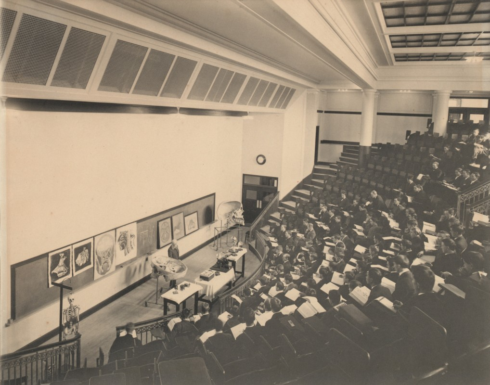
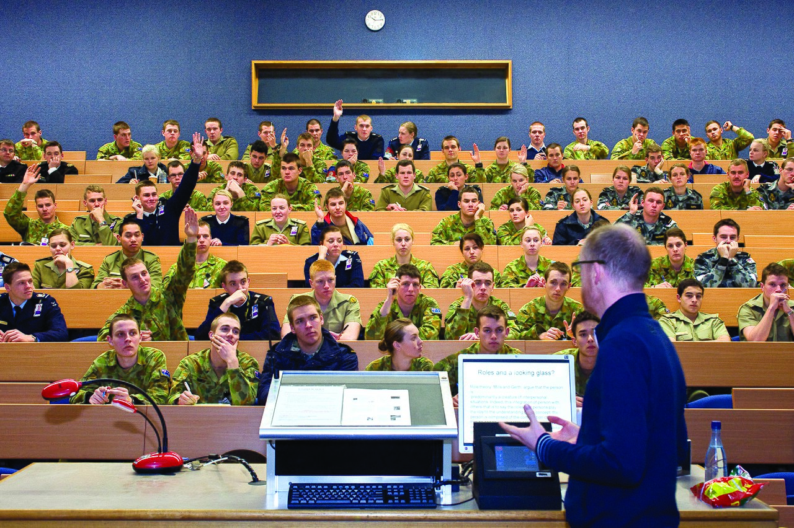
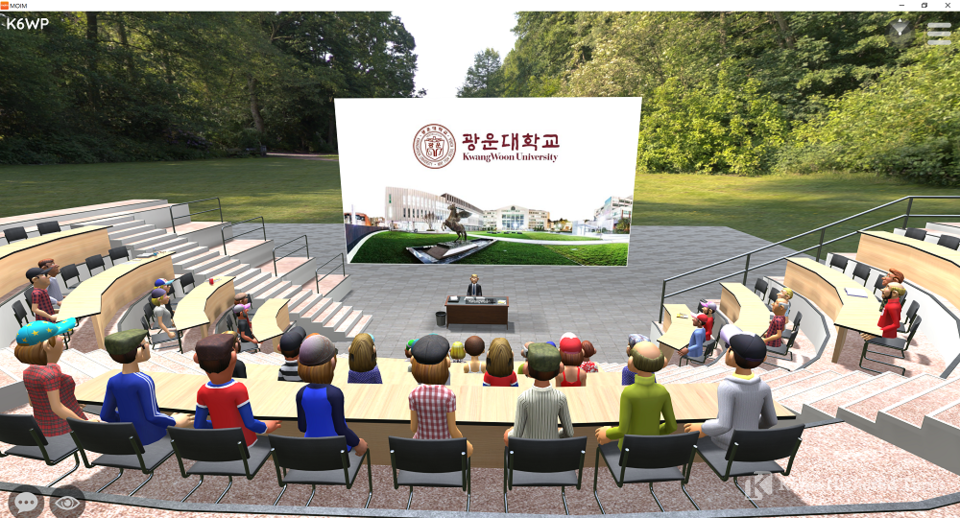
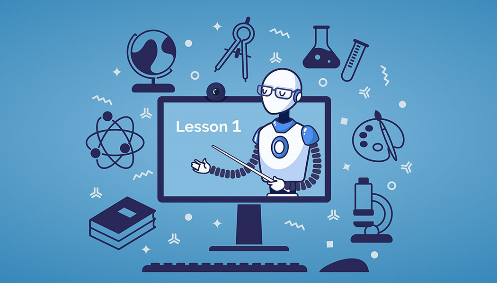
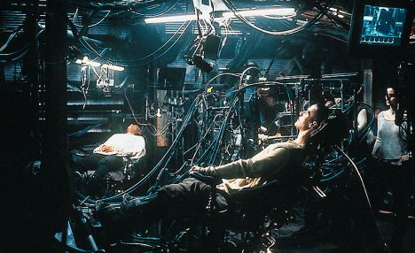
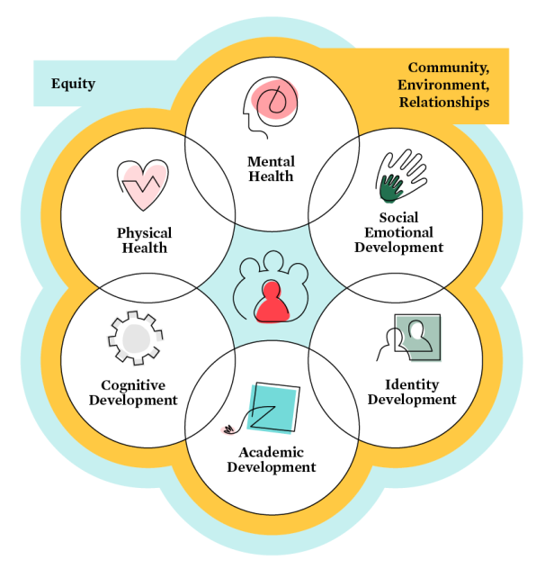

# Educación 2030: El futuro sostenible impulsado por la I.A
## Una oportunidad para rediseñar  

---

# Mi nombre es Juan Franco

 
- Docente
- Universidad Pontificia Bolivariana
- Ingeniería en Diseño de Entretenimiento Digital

---

# Consideraciones

---

## Desde una perfectiva  OPTIMISTA

---

## Son mis percepciones

---

# La educación en el tiempo

---

# 

---

# 

---

#

---

#

---

# ¿Notan algún elemento común en estas imágenes?

---

# Cambia el medio, 
# pero no cambia el propósito

---

# ¿Hay una oportunidad de diseño aquí?

---

# ¿Por qué?

---

# Educación 2030

---

# Les cuento qué pasó con mis clases este 2023-10

---

# Educar para el desarrollo sostenible

---

# Diseñar con un nuevo propósito

---

# Centrar la educación en la vida

---

# Para el desarrollo sostenible interior y colectivo.

---

#

---

# En conclusión

---

# La IA nos ofrece una oportunidad:
# Parar para Reflexionar y Diseñar

---

# Y ustedes ¿Qué oportunidad ven?

---