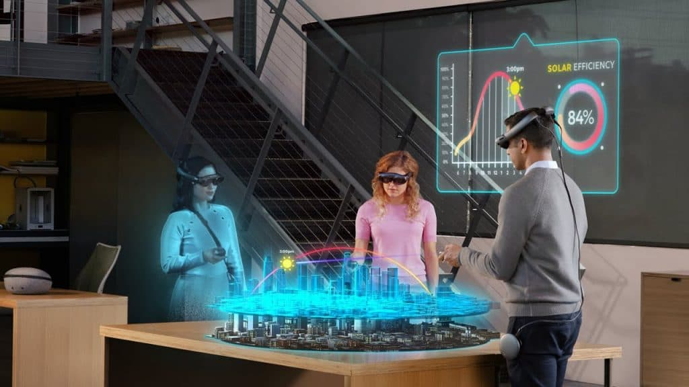
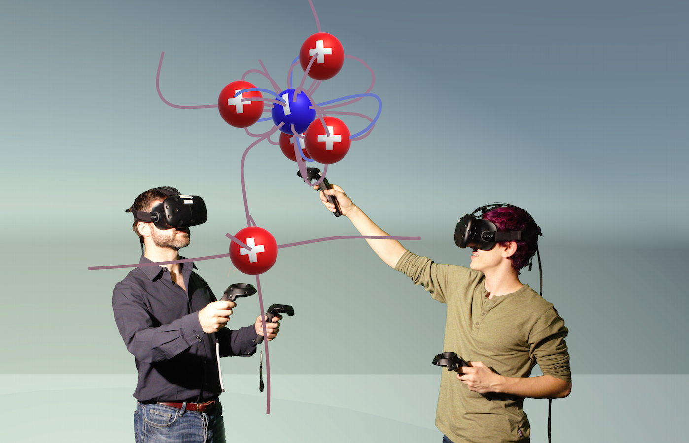
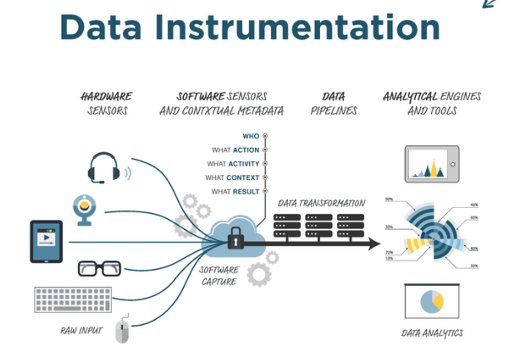

<!-- _class: lead -->
# Educación 2030: El futuro sostenible impulsado por la I.A
## Una oportunidad para rediseñar  

<!---->

<!--## Juan Franco-->

# Mi nombre es Juan Franco

 
- Docente
- Universidad Pontificia Bolivariana
- Ingeniería en Diseño de Entretenimiento Digital

# Consideraciones

- Esta charla se abordará desde una perfectiva  OPTIMISTA.
- Lo que comentaré son mis PERCEPCIONES y producto de mi día a día como docente.

# La educación en el tiempo

<!--# Un acercamiento al concepto

#  

-->

<!-- SPEAKER NOTES
El concepto de metaverse va a combinar la conectividad de la web con la inmersividad de la computación espacial (spatial computing: los computadores tratando de entender el mundo que los rodea) e incluirá crear ambientes y experiencias virtuales, enlazar esos mundos virtuales con el mundo real y permitir interacciones entre múltiples personas
 -->

<!--
# ¿Cómo será la educación en Ingeniería en el Metaverso? 

# 

# Algo no me cuadra del todo...
-->

# 

# 

# 

# 

# 

# ¿Notan algún elemento común en estas imágenes?

# CAMBIA EL MEDIO, PERO NO CAMBIA LA FORMA

# ¿Lo podemos hacer diferente?

# ¿Por qué hacerlo diferente?

# Educación 2030

# La oportunidad

# ¿Cuál?

# Redefinir el propósito de la educación

# Educar para el desarrollo sostenible

# Rediseñar ... Un nuevo propósito

## Centrar la educación en la vida
## Para el desarrollo sostenible interior y colectivo.

<!--
#

#

#

#

#

#

#

#

# ¿Cómo será la educación en Ingeniería en el Metaverso?

# Tal vez como una EXPERIENCIA INTERACTIVA

# “The metaverse education is a highly immersive learning space that ensures better engagement and deeper learning and retention”

# ... Tal vez... pero creo que lo anterior se debe DISEÑAR

# ¿Cómo diseñar estas EXPERIENCIAS?

#

#

#

#

#

#

#

# ¿Cómo será la educación en Ingeniería en el Metaverso?

# Voy en este punto... y seguiré buscando la respuesta
-->

# Y ustedes ¿Qué oportunidad ven?
